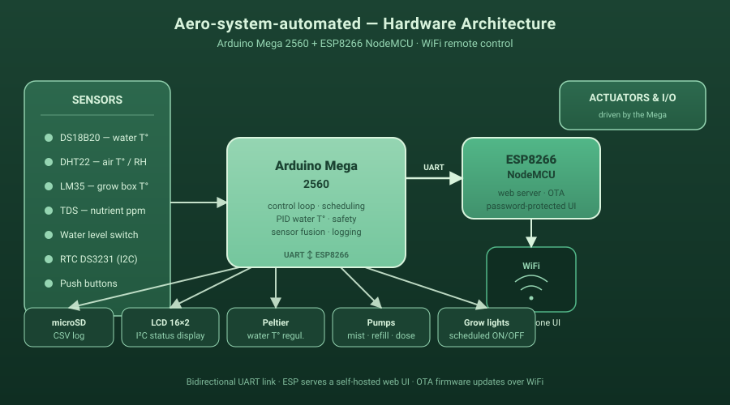

[🇬🇧 English](README.md) | [🇫🇷 Français](README.fr.md)

# Aero-system-automated

<p align="center">
  
</p>

Système aéroponique automatisé contrôlé à distance via WiFi, basé sur **Arduino Mega 2560 + NodeMCU ESP8266**.

Projet personnel réalisé pendant le confinement de mars-avril 2020 — premier projet électronique / Arduino, en partant de zéro.

> Tuto complet (montage, schémas, photos, vidéos) :
> - [Hackster.io — Automated Aeroponic System WiFi Remoted](https://www.hackster.io/alexch03/automated-aeroponic-system-wifi-remoted-b5eaea)
> - [Arduino Project Hub](https://create.arduino.cc/projecthub/alexch03/automated-aeroponic-system-wifi-remoted-b5eaea)

---

## Fonctionnalités

- Mesure et régulation de **la température de l'eau** (DS18B20) via un module Peltier
- Mesure de **la température / humidité de l'air** (DHT22)
- Mesure de **la température de la box** (LM35 sur A2)
- Mesure de la **concentration en nutriments** (capteur TDS sur A8)
- **Remplissage automatique** du réservoir (niveau d'eau)
- **Cycles d'éclairage** programmables (heure ON / heure OFF)
- **Cycles d'arrosage** programmables (durée, fréquence)
- Override manuel des pompes / lampes / pompes péristaltiques
- **Logging** des mesures sur carte microSD
- **Affichage local** sur LCD I²C 16x2 avec animations custom
- **Interface web** (servie par l'ESP8266) accessible depuis smartphone, protégée par mot de passe
- **OTA** (mise à jour du firmware ESP8266 sans fil)

## Architecture

```
                     +--------------------+
   Capteurs ------>  |                    |  <---- Serial ---->  +--------------+
   Relais   <------- |   Arduino Mega 2560|                      | NodeMCU ESP  | <-- WiFi --> Smartphone
   Pompes   <------- |  (boucle de ctrl,  |                      | (serveur web)|
   LCD      <------- |   lecture capteurs,|                      +--------------+
   SD card  <------- |   logique d'auto.) |
   RTC      <------- |                    |
                     +--------------------+
```

- Le **Mega** gère toute la logique : capteurs, relais, pompes, RTC, SD, LCD.
- L'**ESP8266** sert l'interface web et transmet les valeurs / consignes au Mega via liaison série, avec un protocole texte simple `<champ,valeur>`.

## Matériel

| Catégorie | Composant |
|---|---|
| Microcontrôleurs | Arduino Mega 2560, NodeMCU ESP8266 |
| Capteurs | DS18B20 (eau), DHT22 (air), LM35 (box), capteur TDS |
| Affichage | LCD I²C 16x2 |
| Stockage | Lecteur microSD |
| Horloge | RTC DS1302 |
| Actionneurs | 3 × relais 12 V / 10 A, pont en H L298 (Peltier) |
| Pompes | 2 × péristaltiques 12 V (11 mL/min), 3 × pompes à eau 12 V brushless |
| Régulation thermique | Module Peltier + dissipateurs |
| Plomberie | Tuyaux PVC + silicone |

## Brochage (Mega 2560)

Pins définis dans `MEGA-ESP_v08_propre.ino` :

| Fonction | Pin |
|---|---|
| Relais 1 (Peltier) | D24 |
| Pompes (relais) | D22 |
| Lampes (relais) | D26 |
| Moteur A (L298) | D38 / D40 |
| Moteur B (L298) | D36 / D34 |
| RTC DS1302 GND / VCC | D33 / D31 |
| DHT22 | D32 |
| OneWire (DS18B20) | D7 |
| LM35 (Tbox) | A2 |
| TDS | A8 |

## Logiciel

### Bibliothèques requises (côté Mega)

- `EEPROM`
- [`DHT sensor library`](https://github.com/adafruit/DHT-sensor-library)
- [`DallasTemperature`](https://github.com/milesburton/Arduino-Temperature-Control-Library) + `OneWire`
- `SPI`, `SD`
- [`LiquidCrystal_I2C`](https://github.com/johnrickman/LiquidCrystal_I2C)
- [`virtuabotixRTC`](https://github.com/chrisfryer78/ArduinoRTClibrary)
- [`ResponsiveAnalogRead`](https://github.com/dxinteractive/ResponsiveAnalogRead)

### Bibliothèques requises (côté ESP8266)

- `ESP8266WiFi`
- `ESP8266WebServer`
- `ArduinoOTA`

## Fichiers du dépôt

> Les noms de fichiers sont **trompeurs** : c'est le contraire de ce que suggèrent les noms.

| Fichier | Cible | Rôle |
|---|---|---|
| `MEGA-ESP_v08_propre.ino` | **Arduino Mega 2560** | Boucle principale, capteurs, relais, pompes, LCD, SD, RTC, logique d'automatisation |
| `ESP_MEGA_proper_v08.ino` | **NodeMCU ESP8266** | Connexion WiFi, serveur web, OTA, dialogue série avec le Mega |

## Configuration

Avant flash, **modifier dans `ESP_MEGA_proper_v08.ino`** :

```cpp
char* ssid     = "TON_SSID";
char* password = "TON_MOT_DE_PASSE_WIFI";

const char* www_username = "admin";
const char* www_password = "TON_MOT_DE_PASSE_WEB";
```

## Installation

1. Câbler les composants selon le schéma du tuto Hackster.
2. Ouvrir l'IDE Arduino, installer les bibliothèques listées ci-dessus.
3. Sélectionner la carte **Arduino Mega 2560** → flasher `MEGA-ESP_v08_propre.ino`.
4. Sélectionner la carte **NodeMCU 1.0 (ESP-12E)** → modifier le SSID/MDP → flasher `ESP_MEGA_proper_v08.ino`.
5. Connecter le Mega (`Serial1`, pins 18/19) à l'ESP8266 (TX/RX) — **attention au pont diviseur 5 V → 3,3 V** pour le RX de l'ESP.
6. Récupérer l'IP de l'ESP sur le moniteur série, ouvrir dans le navigateur, se logger avec les identifiants ci-dessus.

## Démo / vidéos

Voir les vidéos intégrées sur la page Hackster.io.

## Avertissement

Ce code a tourné des semaines en conditions réelles sans souci, mais il a été écrit en autodidacte pendant le confinement — il n'est pas optimisé et ne respecte pas forcément les conventions Arduino "propres". À utiliser comme base de bidouille / inspiration.

## Auteur

**Alexandros Pantelidis** — projet réalisé en avril 2020.
